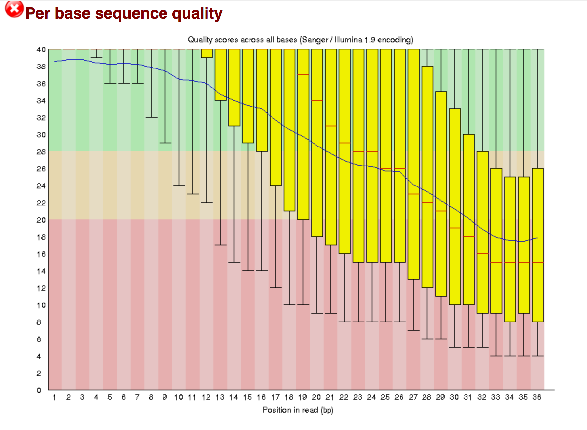
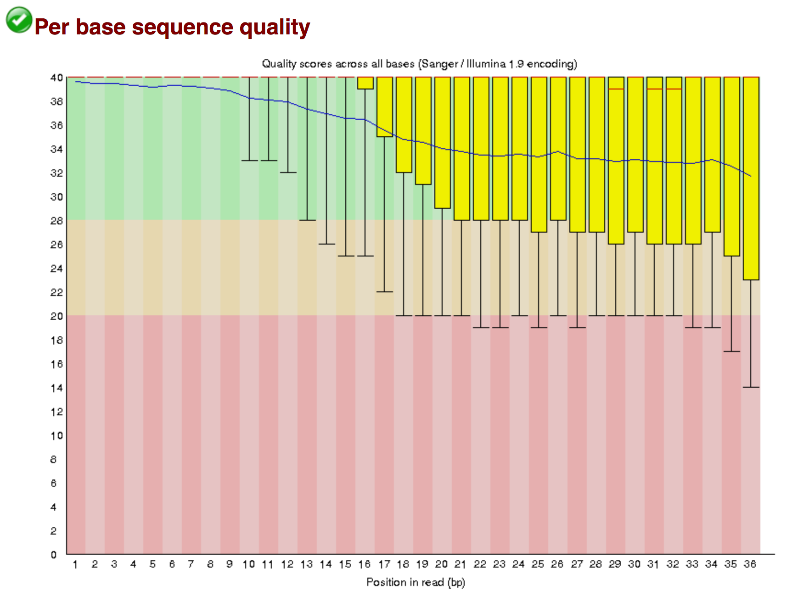
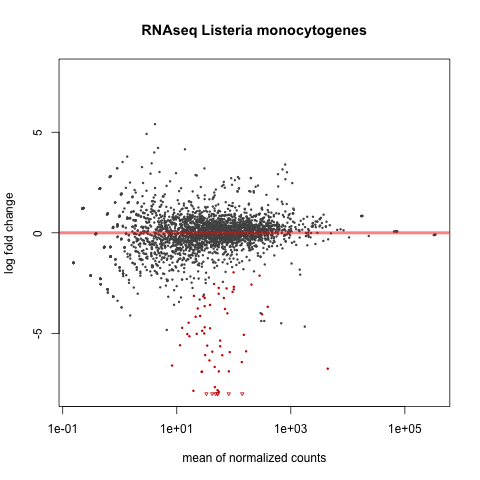
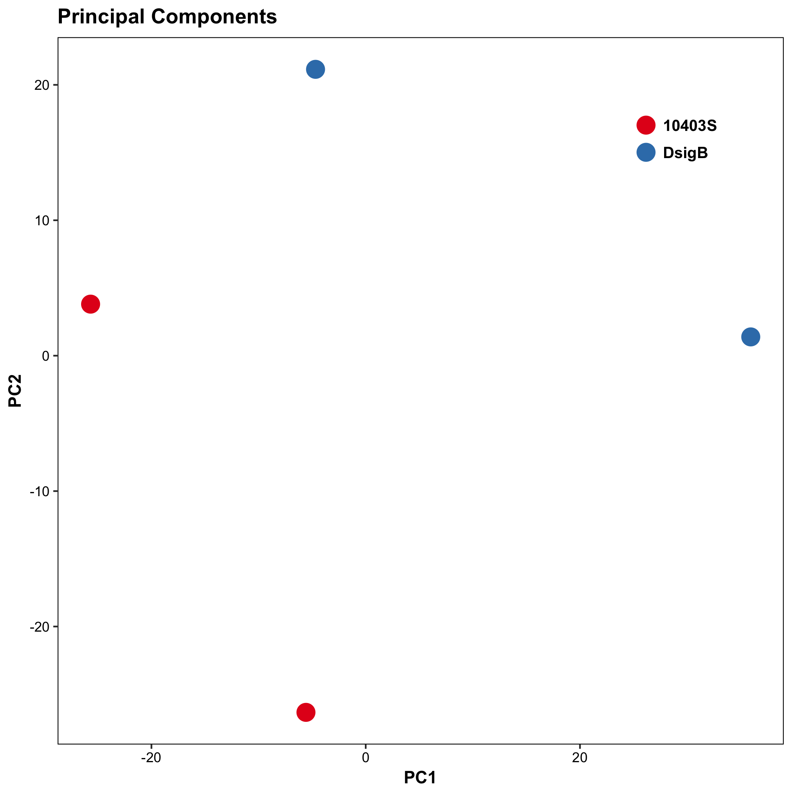
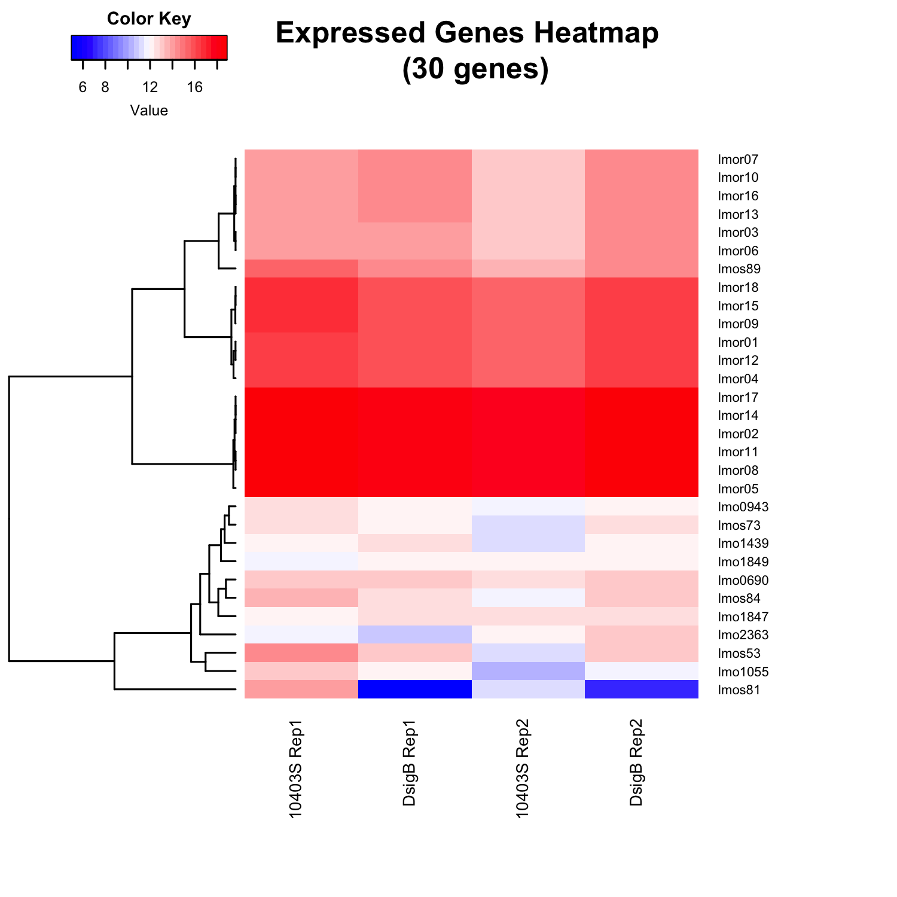

# Prokaryote RNA-Seq Tutorial (EdgePro/DESeq2)

This repository is a usable, publicly available tutorial for analyzing differential expression data and creating topological gene networks. All steps have been provided for the UConn CBC Xanadu cluster here with appropriate headers for the Slurm scheduler that can be modified simply to run.  Commands should never be executed on the submit nodes of any HPC machine.  If working on the Xanadu cluster, you should use sbatch scriptname after modifying the script for each stage.  Basic editing of all scripts can be performed on the server with tools such as nano, vim, or emacs.  If you are new to Linux, please use <a href="https://bioinformatics.uconn.edu/unix-basics">this</a> handy guide for the operating system commands.  In this guide, you will be working with common bio Informatic file formats, such as <a href="https://en.wikipedia.org/wiki/FASTA_format">FASTA</a>, <a href="https://en.wikipedia.org/wiki/FASTQ_format">FASTQ</a>, <a href="https://en.wikipedia.org/wiki/SAM_(file_format)">SAM/BAM</a>, and <a href="https://en.wikipedia.org/wiki/General_feature_format">GFF3/GTF</a>. You can learn even more about each file format <a href="https://bioinformatics.uconn.edu/resources-and-events/tutorials/file-formats-tutorial/">here</a>. If you do not have a Xanadu account and are an affiliate of UConn/UCHC, please apply for one <a href="https://bioinformatics.uconn.edu/contact-us/">here</a>.


<div id="toc_container">
<p class="toc_title">Contents</p>
<ul class="toc_list">
    <li><a href="#Header_1"> 1. Introduction and programs</>
    <li><a href="#Header_2"> 2. Download raw reads in fastq format: SRA Toolkit</>
    <li><a href="#Header_3"> 3. Checking the quality of the reads using FASTQC</>
    <li><a href="#Header_4"> 4. Sickle: Quality Control on raw reads</>
    <li><a href="#Header_5"> 5. Checking the quality of the trimmed reads using FASTQC</>
    <li><a href="#Header_6"> 6. EDGE-pro: Gene expression</>
    <li><a href="#Header_7"> 7. EDGE-pro to DESeq</>
    <li><a href="#Header_8"> 8. Analysis with DESeq</>
</ul>
</div>
      

<h2 id="Header_1">1. Introduction and programs</h2>
This tutorial will serve as an introduction to analysis of prokaryote RNASeq data with an associated reference genome. The tools used for this analysis strictly consist of freeware and open-source software - any bioinformatician can perform the following analysis without any licenses!   

<strong>Software download links:</strong>

<a href="https://github.com/ncbi/sra-tools">SRA Toolkit</a>

<a href="http://www.bioinformatics.babraham.ac.uk/projects/fastqc/">FastQC</a>

<a href="https://github.com/najoshi/sickle">Sickle</a>

<a href="http://ccb.jhu.edu/software/EDGE-pro/">EDGE-pro</a>

<a href="http://www.r-project.org/">R</a>

<a href="https://www.rstudio.com/">RStudio</a>

<a href="http://bioconductor.org/packages/release/bioc/html/DESeq2.html">DESeq2</a>

The folder strucutre for the analysis is as follows:
```bash
Listeria/
├── raw_data
├── fastqc_raw_data
├── sickle_quality_control
├── fastqc_trimmed_reads
├── reference_genome
├── edgepro_gene_expression
└── edgepro_to_DESeq2
```

In this tutorial, we are using the UConn Xanadu cluster, which has a SLURM scheduler. 
The scripts are composed of a header part which is written specifically the clusters scheduler, 
which in this case is the SLURM scheduler. (You may have the change the header of the script depending on your scheduler.) 
```bash
#!/bin/bash
#SBATCH --job-name=jobName   # name of your script
#SBATCH -n 1                 # number of Task to run
#SBATCH -N 1                 # number of nodes 
#SBATCH -c 1                 # number of processors 
#SBATCH --mem=5G             # memory required for the job
#SBATCH --partition=general  # SLURM partition
#SBATCH --qos=general        # SLURM qos
#SBATCH --mail-type=ALL      # mailing options
#SBATCH --mail-user=first.last@uconn.edu
#SBATCH -o %x_%j.out         # output file name
#SBATCH -e %x_%j.err         # error file name
```

If you need more information on the Xanadu and its batch script options please refer to our <a href="https://bioinformatics.uconn.edu/resources-and-events/tutorials-2/xanadu/">Understanding Xanadu HPC Resources website</a>.

<h2 id="Header_2"> 2. Download raw reads in fastq format: SRA Toolkit</h2>
The first step is to retrieve the biological sequence data from the <a href="https://www.ncbi.nlm.nih.gov/sra">Sequence Read Archive</a>. The data that we will be using is from this <a href="https://www.ncbi.nlm.nih.gov/bioproject/PRJNA116667">experiment</a>, which analyzes two strains of Listeria monocytogenes (10403S and DsigB) with two replicates per strain, resulting in a total of four raw read files. We will use the <span style="color: #339966;">fastq-dump</span> utility from the SRA toolkit to download the raw files by accession number into fastq format. This format is necessary because the software used to perform quality control, Sickle, requires fastq files as input.

```bash
#!/bin/bash
#SBATCH --job-name=sra_download
#SBATCH -n 1
#SBATCH -N 1
#SBATCH -c 1
#SBATCH --mem=5G
#SBATCH --partition=general
#SBATCH --qos=general
#SBATCH --mail-type=ALL
#SBATCH --mail-user=first.last@uconn.edu
#SBATCH -o %x_%j.out
#SBATCH -e %x_%j.err

module load sratoolkit/2.8.1
fastq-dump SRR034450
fastq-dump SRR034451
fastq-dump SRR034452
fastq-dump SRR034453

```

The full scrip it called sra_download.sh. The converted reads are located in the <code>/UCHC/PublicShare/RNASeq_Workshop/Listeria/raw_data</code>. The script used is located at: <code>/UCHC/PublicShare/RNASeq_Workshop/Listeria/raw_data/sra_download.sh</code> Please note that this directory is write protected, meaning that the script will need to be run from a different directory. This is also the case for all scripts referenced throughout this tutorial - copy the scripts to a different directory before running them!

Since the fastqdump operation can be resource intensive, we will be submitting this script as a job to the cluster. Before doing so, replace the email in the line: <code><span style="color: #0000ff;">#SBATCH --mail-user= firstname.lastname@uconn.edu</span></code> with your own email. Then submit the script with the <code><span style="color: #339966;">sbatch</span></code> command:
<pre style="color: silver; background: black;"> sbatch sra_download.sh </pre>

For more information on using the Xanadu cluster and SLURM please refer to our tutorial on <a href="https://bioinformatics.uconn.edu/resources-and-events/tutorials/xanadu/">Understanding the Xanadu HPC Resource</a>


<h2 id="Header_3"> 3. Checking the quality of the reads using FASTQC</h2>
FastQC can be used to give an impression of the quality of the data before any further analysis such as quality control. We will run FastQC over the command line on just one of the .fastq files for demonstration purposes.

```bash
fastqc [-o output dir] seqfile1

    -o --outdir     Create all output files in the specified output directory
```

```bash
#!/bin/bash
#SBATCH --job-name=fastqc_raw
#SBATCH -n 1
#SBATCH -N 1
#SBATCH -c 1
#SBATCH --mem=5G
#SBATCH --partition=general
#SBATCH --qos=general
#SBATCH --mail-type=ALL
#SBATCH --mail-user=first.last@uconn.edu
#SBATCH -o %x_%j.out
#SBATCH -e %x_%j.err

echo `hostname`
module load fastqc/0.11.5
fastqc --outdir . ../raw_data/SRR034450.fastq
fastqc --outdir . ../raw_data/SRR034451.fastq
fastqc --outdir . ../raw_data/SRR034452.fastq
fastqc --outdir . ../raw_data/SRR034453.fastq
```


Once the program finishes running, the output will produce a series of html formatted statistics file with the name<code><span style="color: #339966;">SRR034450_fastqc.html</span></code>. 

```bash
fastqc_raw_data/
├── SRR034450_fastqc.html
├── SRR034451_fastqc.html
├── SRR034452_fastqc.html
└── SRR034453_fastqc.html
```

Copy this file to your desktop and open it with a web browser to view the contents, which will contain summary graphs and data such as the 'Per base sequence quality graph' below. You will need to use an sFTP client to move files to you local computer for viewing.  On Xanadu, you will also use a different hostname for this connection with the same login credentials.  Details can be found in the cluster guide <a href="https://bioinformatics.uconn.edu/resources-and-events/tutorials-2/data-transfer/">here</a>.




<h2 id="Header_4"> 4. Sickle: Quality Control on raw reads</h2>

The next step is to perform quality control on the reads using sickle. Since our reads are all unpaired reads, we indicate this with the se option in the sickle command. 
```bash
Usage: sickle se [options] -f [fastq sequence file] -t [quality type] -o [trimmed fastq file]

Command:
se	single-end sequence trimming

Options:
-f  flag designates the input file 
-o  output file  
-q  the minimum quality (sickle defaults to 20) and 
-l  the minimum read length
-t  flag designates the type of read
```

Unfortunately, despite the reads being Illumina reads, the average quality did not meet sickle's minimum for Illumina reads, hence the sanger option.

```bash
#!/bin/bash
#SBATCH --job-name=sickle_qc
#SBATCH -n 1
#SBATCH -N 1
#SBATCH -c 1
#SBATCH --mem=5G
#SBATCH --partition=cbcworkshop
#SBATCH --qos=cbcworkshop
#SBATCH --mail-type=ALL
#SBATCH --mail-user=first.last@uconn.edu
#SBATCH -o %x_%j.out
#SBATCH -e %x_%j.err

echo `hostname`
module load sickle/1.33

sickle se -f ../raw_data/SRR034450.fastq -t sanger -o SRR034450_trimmed.fastq
sickle se -f ../raw_data/SRR034451.fastq -t sanger -o SRR034451_trimmed.fastq
sickle se -f ../raw_data/SRR034452.fastq -t sanger -o SRR034452_trimmed.fastq
sickle se -f ../raw_data/SRR034453.fastq -t sanger -o SRR034453_trimmed.fastq
```

The script is called `sickle_qc.sh` which can be found in `//UCHC/PublicShare/RNASeq_Workshop/Listeria/sickle_quality_control` folder. Following the sickle run it will produce the trimmed read files:
```bash
sickle_quality_control/
├── SRR034450_trimmed.fastq
├── SRR034451_trimmed.fastq
├── SRR034452_trimmed.fastq
└── SRR034453_trimmed.fastq
```

During the sickle run it will output the summary of each fastq file which indicates the total number of records, number of records it kept and number of records it discarded. This information will be written to the .out file during the run.
```
xanadu-10.cam.uchc.edu

SE input file: ../raw_data/SRR034450.fastq

Total FastQ records: 3489648
FastQ records kept: 2282100
FastQ records discarded: 1207548


SE input file: ../raw_data/SRR034451.fastq

Total FastQ records: 3316959
FastQ records kept: 3074420
FastQ records discarded: 242539


SE input file: ../raw_data/SRR034452.fastq

Total FastQ records: 4240141
FastQ records kept: 3759552
FastQ records discarded: 480589


SE input file: ../raw_data/SRR034453.fastq

Total FastQ records: 5246743
FastQ records kept: 4018652
FastQ records discarded: 1228091
```


<h2 id="Header_5"> 5. Checking the quality of the trimmed reads using FASTQC</h2>
Now we will use the FASTQC tools to check the quality of reads after trimming.

```bash
#!/bin/bash
#SBATCH --job-name=fastqc_trimmed
#SBATCH -n 1
#SBATCH -N 1
#SBATCH -c 1
#SBATCH --mem=5G
#SBATCH --partition=general
#SBATCH --qos=general
#SBATCH --mail-type=ALL
#SBATCH --mail-user=first.last@uconn.edu
#SBATCH -o %x_%j.out
#SBATCH -e %x_%j.err   

module load fastqc/0.11.5

fastqc --outdir . ../sickle_quality_control/SRR034450_trimmed.fastq
fastqc --outdir . ../sickle_quality_control/SRR034451_trimmed.fastq
fastqc --outdir . ../sickle_quality_control/SRR034452_trimmed.fastq
fastqc --outdir . ../sickle_quality_control/SRR034453_trimmed.fastq
```

The above script is called `fastqc_trimmed.sh` and it is located at `/UCHC/PublicShare/RNASeq_Workshop/Listeria/fastqc_trimmed_reads` This will produce the html files with statistics, which can be downloaded and viewed.
```
fastqc_trimmed_reads
├── SRR034450_trimmed_fastqc.html
├── SRR034451_trimmed_fastqc.html
├── SRR034452_trimmed_fastqc.html
└── SRR034453_trimmed_fastqc.html
```




<h2 id="Header_6"> 6. EDGE-pro: Gene expression</h2>

Before we get started with EDGE-pro, we need to retrieve the Listeria reference genome and its protein and rna tables. By searching the NCBI genome database, we learn that the <a href="http://www.ncbi.nlm.nih.gov/genome/159">EGD-e strain is the reference genome</a>. We will use NCBI's ftp website: <a href="ftp://ftp.ncbi.nih.gov/">ftp://ftp.ncbi.nih.gov/</a> to download the files. Since Listeria is a bacterial genome, navigate to the genome directory then bacteria directory. Note that there are multiple genomes for Listeria -- navigate to the EGD-e assembly: <a href="ftp://ftp.ncbi.nih.gov/genomes/Bacteria/Listeria_monocytogenes_EGD_e_uid61583/">ftp://ftp.ncbi.nih.gov/genomes/Bacteria/Listeria_monocytogenes_EGD_e_uid61583/</a>

```
Working Directory:
**reference_genome/**
```

The reference genome is stored in the .fna file, protein table in the .ptt file, and rna table in the .rnt file. We will use the wget command line utility to download these files.

```bash
#!/bin/bash
#SBATCH --job-name=genome
#SBATCH -n 1
#SBATCH -N 1
#SBATCH -c 1
#SBATCH --mem=5G
#SBATCH --partition=general
#SBATCH --qos=general
#SBATCH --mail-type=ALL
#SBATCH --mail-user=first.last@uconn.edu
#SBATCH -o %x_%j.out
#SBATCH -e %x_%j.err

echo `hostname`

#################################################################
# Download the reference files
#################################################################
wget http://genome2d.molgenrug.nl/Bacteria/Listeria_monocytogenes_EGD_e_uid61583/NC_003210.fna
wget http://genome2d.molgenrug.nl/Bacteria/Listeria_monocytogenes_EGD_e_uid61583/NC_003210.ptt
wget http://genome2d.molgenrug.nl/Bacteria/Listeria_monocytogenes_EGD_e_uid61583/NC_003210.rnt
```

Once downloaded, these files are located in `/UCHC/PublicShare/RNASeq_Workshop/Listeria/reference_genome` folder in Xanadu server. The full script to download the genome reference files is called `genome.sh` 
```
reference_genome/
├── NC_003210.fna
├── NC_003210.ptt
└── NC_003210.rnt
```


```
Working Directory:
<strong>edgepro_gene_expression/</strong>
```
Now we can run EDGE-pro to generate gene expression levels. The -g option takes a reference genome, -p flag a protein table, -r flag an rnt table, -u flag a fastq file (the trimmed file from sickle). The -o flag will be the prefix before each of the EDGE-pro output files, and the -s flag is the directory where the EDGE-pro executables are located.

```
useage:
[OMP_NUM_THREADS=n] PATH/edge.perl [-g genome] [-p ptt] [-r rnt] [-u reads] [options]

MANDATORY FILES:
-g genome: fasta file containing bacterial genome
-p ptt: ptt file with coordinates of coding genes, in Genbank format
-r rnt: rnt file with coordinates of rRNAs and tRNAs, in Genbank format
-u reads: fastq file of reads

OPTIONAL FILES/PARAMETERS:
-s source_dir: It is a string specifying the absolute of relative path to the directory that contains all scripts. Default: working directory.
-o prefix: It is a string specifying the prefix of all output files
```

The Edge-Pro program can be called using following method, and it will create rpkm files for each of the trimmed input fasta files.
```bash
#!/bin/bash
#SBATCH --job-name=edgepro_rpkm
#SBATCH -n 1
#SBATCH -N 1
#SBATCH -c 8
#SBATCH --mem=20G
#SBATCH --partition=cbcworkshop
#SBATCH --qos=cbcworkshop
#SBATCH --mail-type=ALL
#SBATCH --mail-user=first.last@uconn.edu
#SBATCH -o %x_%j.out
#SBATCH -e %x_%j.err

echo `hostname`
module load EDGE_pro/1.3.1

edge.pl -g ../reference_genome/NC_003210.fna \
        -p ../reference_genome/NC_003210.ptt \
        -r ../reference_genome/NC_003210.rnt \
        -u ../sickle_quality_control/SRR034450_trimmed.fastq \
        -o SRR034450.out \
        -s /isg/shared/apps/EDGE_pro/1.3.1 \
        -t 8

edge.pl -g ../reference_genome/NC_003210.fna \
        -p ../reference_genome/NC_003210.ptt \
        -r ../reference_genome/NC_003210.rnt \
        -u ../sickle_quality_control/SRR034451_trimmed.fastq \
        -o SRR034451.out \
        -s /isg/shared/apps/EDGE_pro/1.3.1 \
        -t 8

edge.pl -g ../reference_genome/NC_003210.fna \
        -p ../reference_genome/NC_003210.ptt \
        -r ../reference_genome/NC_003210.rnt \
        -u ../sickle_quality_control/SRR034452_trimmed.fastq \
        -o SRR034452.out \
        -s /isg/shared/apps/EDGE_pro/1.3.1 \
        -t 8

edge.pl -g ../reference_genome/NC_003210.fna \
        -p ../reference_genome/NC_003210.ptt \
        -r ../reference_genome/NC_003210.rnt \
        -u ../sickle_quality_control/SRR034453_trimmed.fastq \
        -o SRR034453.out \
        -s /isg/shared/apps/EDGE_pro/1.3.1 \
        -t 8
 ```

The above script is called <code>edgepro_rpkm.sh</code> and it can be located at <code>/UCHC/PublicShare/RNASeq_Workshop/Listeria/edgepro_gene_expression</code>

Edge-Pro executes several steps in the analysis.  It will index the reference genome, align the reads to this indexed reference, and calculate RPKM values based on these alignments.  Edge-Pro using Bowtie as its aligner and it is optimizing the alignments for genes that do not contain introns.  We can move forward directly with the RPKM values into certain differential expression packages but since we will use DESeq2 which requires raw counts, we will convert these values back to raw counts for the analysis. 
```
edgepro_gene_expression/
├── SRR034450.out.alignments
├── SRR034450.out.chrNum
├── SRR034450.out.counts_0
├── SRR034450.out.genes_0
├── SRR034450.out.genomeSize
├── SRR034450.out.index.1.bt2
├── SRR034450.out.index.2.bt2
├── SRR034450.out.index.3.bt2
├── SRR034450.out.index.4.bt2
├── SRR034450.out.index.rev.1.bt2
├── SRR034450.out.index.rev.2.bt2
├── SRR034450.out.multipleCounts_0
├── SRR034450.out.numberMultiReads
├── SRR034450.out.numberReads
├── SRR034450.out.numberUniqueReads
├── SRR034450.out.readLength
├── SRR034450.out.rpkm_0
├── SRR034450.out.rpkm.numberReads
├── SRR034450.out.rRNA.numberReads
└── SRR034450.out.uniqueCounts_0
```


<h2 id="Header_7"> 7. EDGE-pro to DESeq</h2>
The output we are interested in are the SRR03445X.out.rpkm_0 files. 
So we will copy the \*.rpkm files from to our working directory. using

```bash
cp ../edgepro_gene_expression/*.rpkm_0 .  
```

EDGE-pro comes with an accessory script to convert the rpkm files to a count table that DESeq2, the differential expression analysis R package, can take as input.
```perl
/isg/shared/apps/EDGE_pro/1.3.1/additionalScripts/edgeToDeseq.perl SRR034450.out.rpkm_0 SRR034451.out.rpkm_0 SRR034452.out.rpkm_0 SRR034453.out.rpkm_0
```

Please note that EDGE-pro may sometimes create a second row for a gene with different count data than the first row. For our analysis with DESeq we desire each of the rows to be labeled with a gene ID, and this means that the list of genes must be unique. A python script was written to remove the duplicate row with the smallest total count. Writing this script is beyond the scope of this tutorial, but if you are interested, the script with comments is located at <code>/UCHC/PublicShare/RNASeq_Workshop/Listeria/edgepro_to_DESeq2/trim_epro2deseq.py</code> This python script is executable globally so that you do not need to copy it to your own directory.  We will run the script as:
```python
python trim_epro2deseq.py deseqFile
```

where deseqFile is the intermediate output from edgeToDeseq.perl. The final, trimmed output table (a tab delimited file) is located at <code>/UCHC/PublicShare/RNASeq_Workshop/Listeria/edgepro_to_DESeq2/Listeria_deseqFile</code>. The script to generate the file is located at <code>/UCHC/PublicShare/RNASeq_Workshop/Listeria/edgepro_to_DESeq2/to_DESeq2.sh</code> and contains the commands to generate both the deseqFile and final Listeria_deseqFile.


<h2 id="Header_8"> 8. Analysis with DESeq</h2>

This step requires the R language and an IDE such as RStudio installed on a local machine. The R DESeq2 library also must be installed. To install this package, start the R console and enter:
```R
source("http://bioconductor.org/biocLite.R")
biocLite("DESeq2")
```

If any dependencies fail, install them using the command: <code>install.packages(PackageName, repos='http://cran.rstudio.com/')</code>

Before running this script make sure to set the working directory and path to your Listeria_deseqFile (after copying it from the server to your local machine). The script was adapted slightly from Dave Wheeler's comprehensive tutorial on analysis with DESeq2. The only changes were a few bug fixes, adding an outputPrefix variable to allow easy modification of the output file names in the code for future use, and adding filtering by adjusted p value.

The most important information comes out as -replaceoutliers-results.csv. This file only contains the genes that have adjusted p values less than 0.05. These genes are the differentially expressed genes we are interested in. Depending on the experiment, this file can be adjusted to include p values less than 0.10 or a different value.
```R
# Load DESeq2 library
library("DESeq2")

# Set the working directory
directory <- "~/Documents/R/DESeq2/"
setwd(directory)

# Set the prefix for each output file name
outputPrefix <- "Listeria_DESeq2"

# Location of deseq ready count table (EDGE-pro output)
deseqFile <- "~/Documents/R/DESeq2/Listeria_deseqFile"

# Read the table
countData <- read.table(deseqFile, header = T)

# Replace accession numbers with meaningful names
names(countData) <- c("10403S Rep1","DsigB Rep1","10403S Rep2","DsigB Rep2")

# Create table with treatment information
sampleNames <- colnames(countData)
sampleCondition <- c("10403S","DsigB","10403S","DsigB")
colData <- data.frame(condition = sampleCondition)
row.names(colData) = sampleNames
treatments = c("10403S","DsigB")

# Create DESeqDataSet: countData is the count table, colData is the table with treatment information
# One experimental condition
ddsFromMatrix <- DESeqDataSetFromMatrix(countData = countData,
 colData = colData,
 design = ~ condition)
colData(ddsFromMatrix)$condition <- factor(colData(ddsFromMatrix)$condition, levels = treatments)
dds <- DESeq(ddsFromMatrix)
res <- results(dds)

# filter results by p value
# order results by padj value (most significant to least)
res= subset(res, padj<0.05)
res <- res[order(res$padj),]
# should see DataFrame of baseMean, log2Foldchange, stat, pval, padj

# save data results and normalized reads to csv
resdata <- merge(as.data.frame(res), as.data.frame(counts(dds,normalized =TRUE)), by = 'row.names', sort = FALSE)
names(resdata)[1] <- 'gene'
write.csv(resdata, file = paste0(outputPrefix, "-results-with-normalized.csv"))

# send normalized counts to tab delimited file for GSEA, etc.
write.table(as.data.frame(counts(dds),normalized=T), file = paste0(outputPrefix, "_normalized_counts.txt"), sep = '\t')

# produce DataFrame of results of statistical tests
mcols(res, use.names = T)
write.csv(as.data.frame(mcols(res, use.name = T)),file = paste0(outputPrefix, "-test-conditions.csv"))

# replacing outlier value with estimated value as predicted by distrubution using
# "trimmed mean" approach. recommended if you have several replicates per treatment
# DESeq2 will automatically do this if you have 7 or more replicates
ddsClean <- replaceOutliersWithTrimmedMean(dds)
ddsClean <- DESeq(ddsClean)
tab <- table(initial = results(dds)$padj < 0.05,
 cleaned = results(ddsClean)$padj < 0.05)
addmargins(tab)
write.csv(as.data.frame(tab),file = paste0(outputPrefix, "-replaceoutliers.csv"))
resClean <- results(ddsClean)

# filter results by p value
resClean = subset(res, padj<0.05)
resClean <- resClean[order(resClean$padj),]
write.csv(as.data.frame(resClean),file = paste0(outputPrefix, "-replaceoutliers-results.csv"))
```

```R
####################################################################################
# Exploratory data analysis of RNAseq data with DESeq2
#
# these next R scripts are for a variety of visualization, QC and other plots to
# get a sense of what the RNAseq data looks like based on DESEq2 analysis
#
# 1) MA plot
# 2) rlog stabilization and variance stabiliazation
# 3) heatmap of clustering analysis
# 4) PCA plot
#
#
####################################################################################

# MA plot of RNAseq data for entire dataset
# http://en.wikipedia.org/wiki/MA_plot
# genes with padj < 0.1 are colored Red
plotMA(dds, ylim=c(-8,8),main = "RNAseq Listeria monocytogenes")
dev.copy(png, paste0(outputPrefix, "-MAplot_initial_analysis.png"))
dev.off()
```



```R
# transform raw counts into normalized values
# DESeq2 has two options: 1) rlog transformed and 2) variance stabilization
# variance stabilization is very good for heatmaps, etc.
rld <- rlogTransformation(dds, blind=T)
vsd <- varianceStabilizingTransformation(dds, blind=T)

# save normalized values
write.csv(as.data.frame(assay(rld)),file = paste0(outputPrefix, "-rlog-transformed-counts.txt"))
write.csv(as.data.frame(assay(vsd)),file = paste0(outputPrefix, "-vst-transformed-counts.txt"))


#Principal components plot shows clustering of samples
library("genefilter")
library("ggplot2")
library("grDevices")

rv <- rowVars(assay(rld))
select <- order(rv, decreasing=T)[seq_len(min(500,length(rv)))]
pc <- prcomp(t(assay(vsd)[select,]))

# set condition
condition <- treatments
scores <- data.frame(pc$x, condition)

(pcaplot <- ggplot(scores, aes(x = PC1, y = PC2, col = (factor(condition)))) 
+ geom_point(size = 5)
+ ggtitle("Principal Components")
+ scale_colour_brewer(name = " ", palette = "Set1")
+ theme(
 plot.title = element_text(face = 'bold'),
 legend.position = c(.85,.87),
 legend.key = element_rect(fill = 'NA'),
 legend.text = element_text(size = 10, face = "bold"),
 axis.text.y = element_text(colour = "Black"),
 axis.text.x = element_text(colour = "Black"),
 axis.title.x = element_text(face = "bold"),
 axis.title.y = element_text(face = 'bold'),
 panel.grid.major.x = element_blank(),
 panel.grid.major.y = element_blank(),
 panel.grid.minor.x = element_blank(),
 panel.grid.minor.y = element_blank(),
 panel.background = element_rect(color = 'black',fill = NA)
))

ggsave(pcaplot,file=paste0(outputPrefix, "-ggplot2.png"))
```



```R
# scatter plot of rlog transformations between Sample conditions
# nice way to compare control and experimental samples
# uncomment plots depending on size of array
# head(assay(rld))
plot(log2(1+counts(dds,normalized=T)[,1:2]),col='black',pch=20,cex=0.3, main='Log2 transformed')
plot(assay(rld)[,1:2],col='#00000020',pch=20,cex=0.3, main = "rlog transformed")
plot(assay(rld)[,3:4],col='#00000020',pch=20,cex=0.3, main = "rlog transformed")

# heatmap of data
library("RColorBrewer")
library("gplots")
# 30 top expressed genes with heatmap.2
select <- order(rowMeans(counts(ddsClean,normalized=T)),decreasing=T)[1:30]
my_palette <- colorRampPalette(c("blue",'white','red'))(n=30)
heatmap.2(assay(vsd)[select,], col=my_palette,
 scale="row", key=T, keysize=1, symkey=T,
 density.info="none", trace="none",
 cexCol=0.6, labRow=F,
 main="TITLE")
dev.copy(png, paste0(outputPrefix, "-HEATMAP.png"))
dev.off()
```


